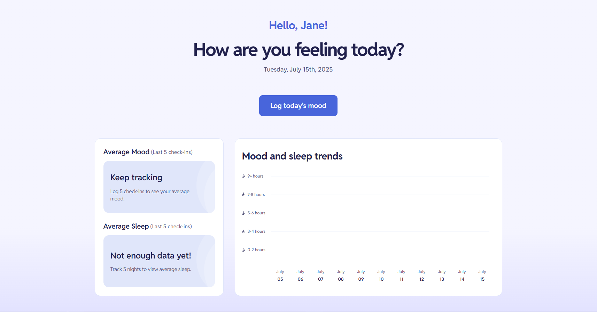
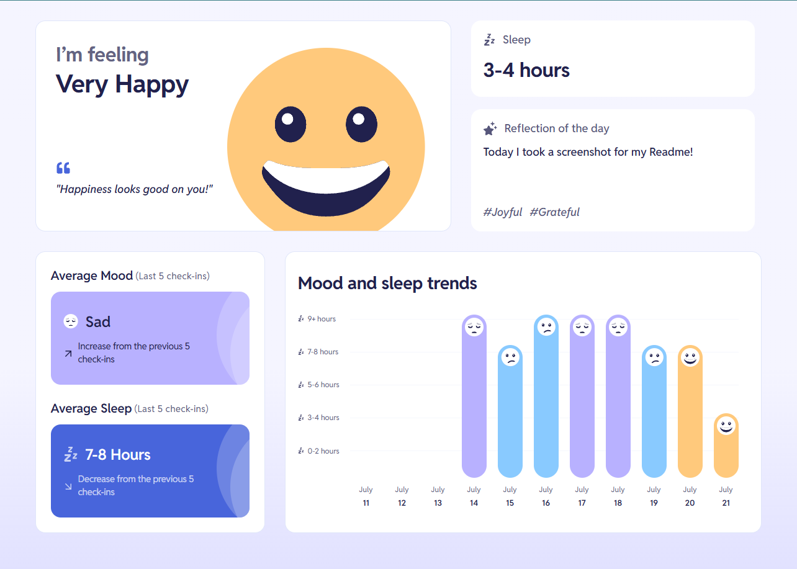

# (Frontend Mentor) Mood Tracker 🧠🌙

## 🇧🇷 Português

Aplicação web para registrar e acompanhar o humor, sono e emoções diárias. Os usuários podem criar uma conta, fazer check-ins diários e visualizar tendências do seu bem-estar ao longo do tempo.

## 🚀 Funcionalidades

- Registro e login de usuário
- Nome e foto personalizáveis por usuário
- Registro de humor e sono diário
- Gráfico visual que fornece ao usuário informações sobre os últimos 11 registros feitos
- Campo que mostra a "média" do humor dos últimos 5 registros (ver abaixo a explicação de como eu tratei a média de humor)
- Campo que mostra a média de sono dos últimos 5 registros

## 🧮 Cálculo

- **Média do humor:**  
  Se um humor aparecer mais vezes que os outros, ele será escolhido.  
  Se houver empate (ex: 2 "very happy", 2 "neutral", 1 "happy"), o humor desempata com base na proximidade entre os outros — o "happy" puxa para o "very happy", então ele é o escolhido.  
  Se houver um de cada, o resultado será "neutral".

- **Datas do gráfico:**  
  Ordeno os registros pelas datas mais recentes. Caso o usuário tenha menos de 11 registros, completo com datas anteriores, retrocedendo a partir da mais antiga. Se não houver nenhum registro, começo com a data de hoje e retrocedo até completar 11.

## 📸 Screenshots

  

---

## 🇺🇸 English

Web application to record and track daily mood, sleep, and emotions. Users can create an account, log daily check-ins, and view their well-being trends over time.

## 🚀 Features

- User registration and login
- Customizable name and profile picture
- Daily mood and sleep tracking
- Visual chart showing the last 11 records
- Section that calculates and displays the average mood from the last 5 check-ins
- Section that displays the average sleep duration from the last 5 check-ins

## 🧮 Logic

- **Average mood:**  
  If one mood appears more than others, it is chosen.  
  If there's a tie (e.g. 2 "very happy", 2 "neutral", 1 "happy"), the third mood is used to break the tie — "happy" leans more towards "very happy", so that one is chosen.  
  If there’s one of each mood, the result will be "neutral".

- **Chart dates:**  
  Dates are sorted from the most recent. If there are fewer than 11 records, older dates are filled in retroactively. If no records exist, the chart starts from today and fills backward until 11 days are reached.

## 📸 Screenshots

  

